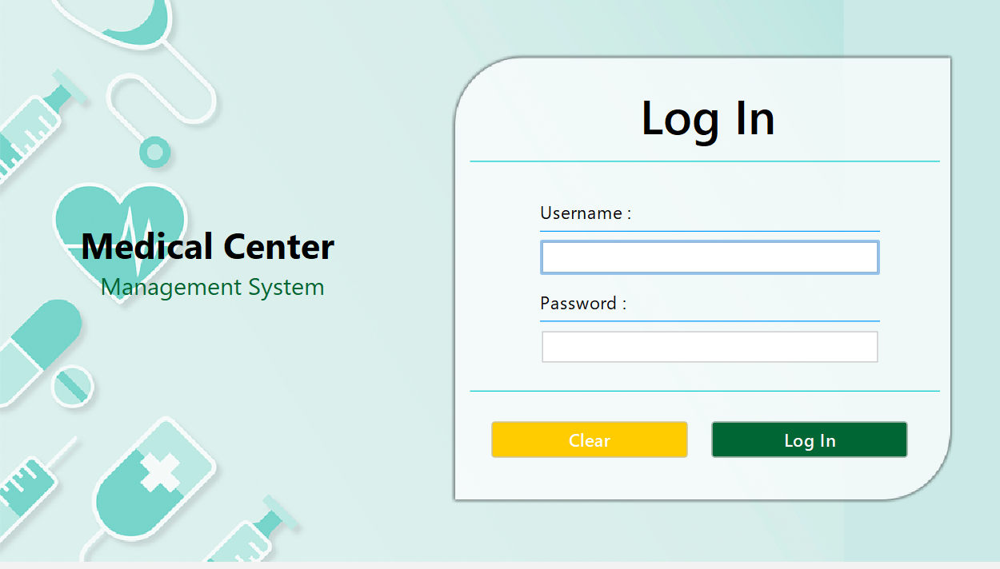
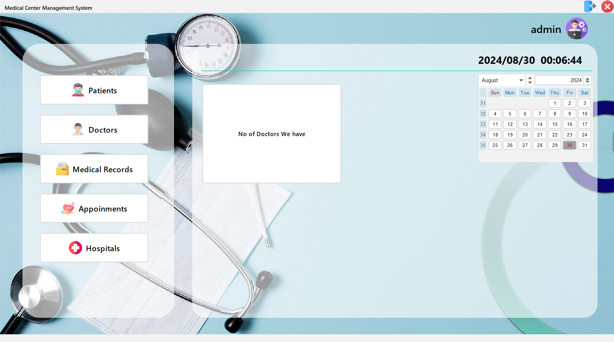
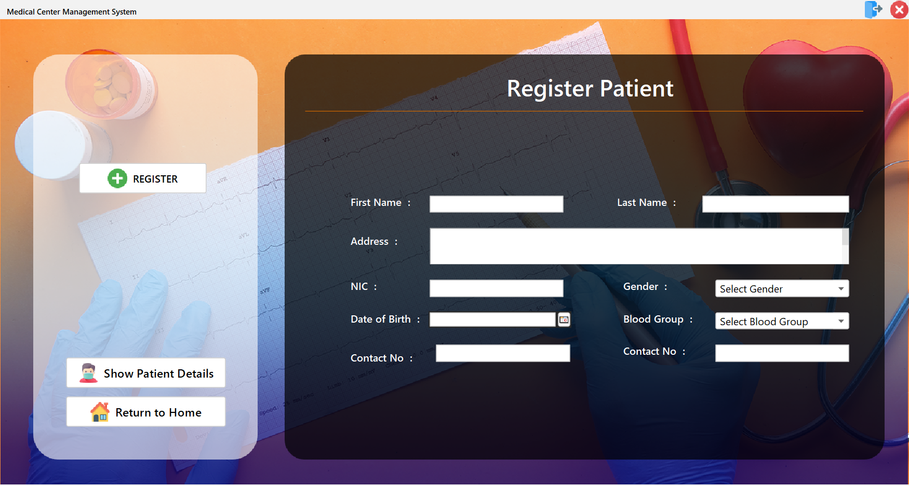
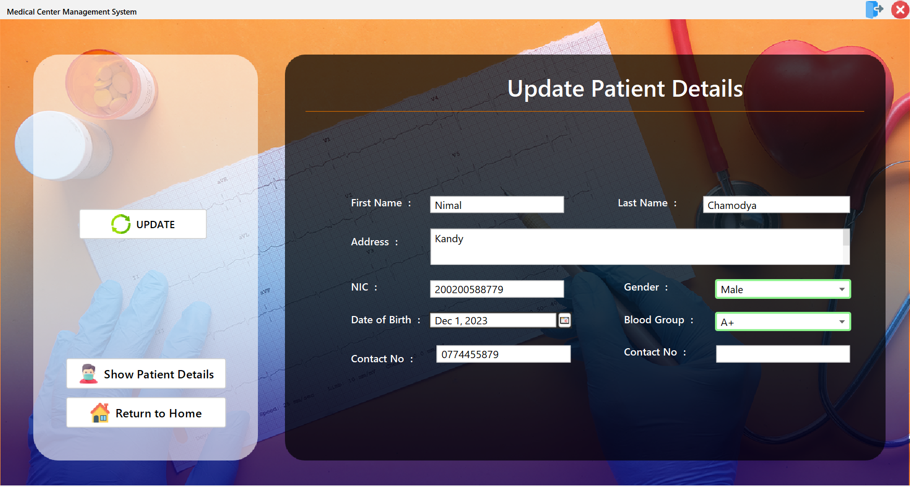
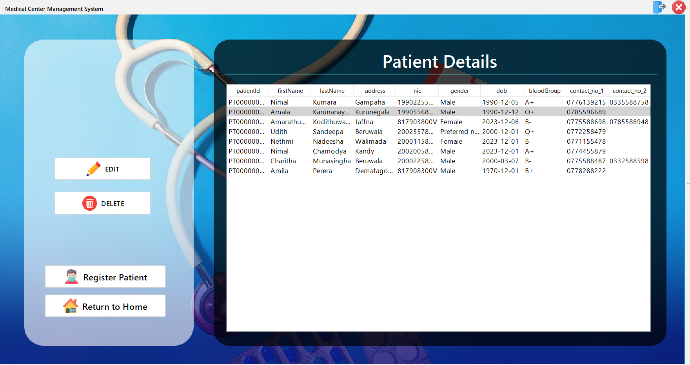

# Medical Center Management System using Java

This one is our final project of the course module **COST 21053 - Object Oriented Programming** which is offered in 2nd year 1st semester. This project is based on Medical center of our university.

## Table of contents

- [Overview](#overview)
  - [Functionalities](#functionalities)
  - [Screenshot](#screenshot)
- [My process](#my-process)
  - [Built with](#built-with)
- [Author](#author)

## Overview

### functionalities

- Login with credentials (username and password) 
- Role based dashboard (Admin,Doctor,reception)
- Access control based on Role
- Register, Update, Remove Patients and get Patient Details
- Register, Update, Remove Doctors and get Doctors Details
- Add medical record
- make an appoinment
- generate medical reports

> [!NOTE]
> Above functionalities are main functionalities

### Screenshot - Log in

### Screenshot - Dashboard

### Screenshot - Patient Register

### Screenshot - Update Patient

### Screenshot - View Patient Details

## My process

### Built with

- [JDK 17](https://www.oracle.com/java/technologies/javase/jdk17-archive-downloads.html)
- mySQL database
- flatlaf-3.2.5 - Enhance UI experience in Java Swing appication
- mysql-connector-j-8.1.0 - connect mySQL database
- rs2xml - generate table 
- jcalendar-1.4 - generate calender component
- itextpdf-5.4.0 - generate pdf file
- itext7-7.0.4 - generate pdf file

## Author

<!-- - Website - [Add your name here](https://www.your-site.com) -->
- Frontend Mentor - [@AchinthyaDulshan](https://www.frontendmentor.io/profile/AchinthyaDulshan)
- LinkedIn - [Achinthya Dulshan](https://www.linkedin.com/in/achinthya-dulshan-6a0616221/)
- X - [@Achi_Dulshan](https://x.com/Achi_Dulshan)

